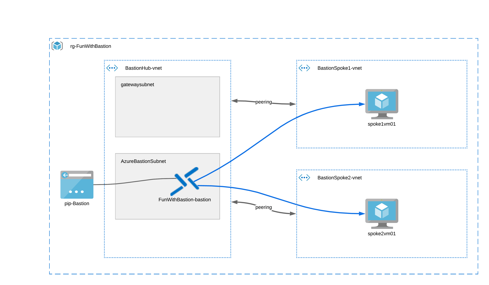

# Fun with Bastion
These bicep templates will create a hub and spoke environment with 2 VMs. Each VM is located
in its own vNet.
The hub vNet will include Bastion, which can then be used to remote into the VMs

