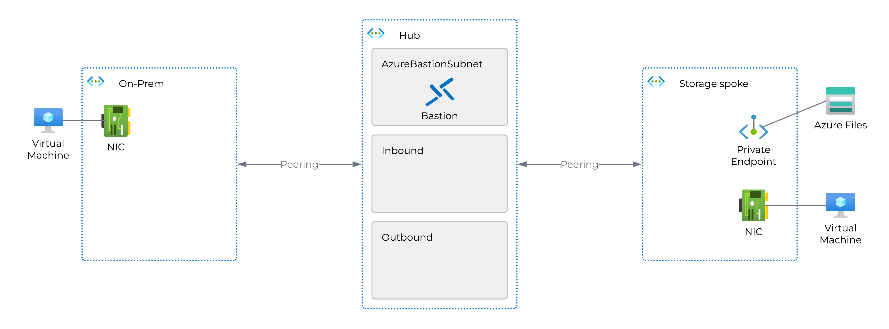

# Private Resolver demo environment
This bicep template will create a hub and spoke environment with 1 hub and 2 spokes. One of the spokes will act as an on-prem network, and the other will act as a VNet in the cloud.  
Both of the spokes will have a VM connected to it, and the cloud vnet will also have a storage account and a private endpoint to the storage account.  
See drawing here: 

The on-prem network will use 1.1.1.1 as its DNS server, and the cloud vnet will use the standard Azure DNS. 
We then add a private resolver to the hub vnet, and configure the on-prem network to use the private resolver as its DNS server. That way the on-prem network can resolve the private endpoint to the storage account.

## How to deploy
Prerequisites:
- Bicep
- Azure Powershell modules:
    - Az.Accounts
    - Az.Resources

To deploy the environment, you can use the following command:
```powershell
New-AzResourceGroupDeployment -Name "Test-01" -ResourceGroupName <resource group name> -TemplateFile .\PrivateResolver\main.bicep
```