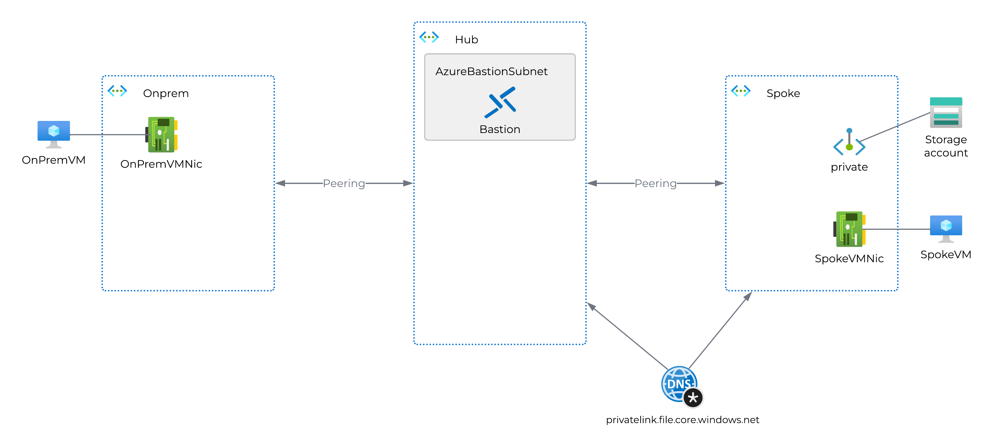

# Private Resolver demo environment
This bicep template will create a demo environment for the private resolver feature in Azure.
You can opt for creating a fully working setup with private resolver right away, or you can deploy a setup without the private resolver and manually add that. The latter is useful if you want to learn how to add private resolver to an existing environment.

Prerequisites:
- Bicep installed
- Azure Powershell modules:
    - Az.Accounts
    - Az.Resources
- A pre-existing resource group

## Lab environment without Private Resolver
This will create three vNets, two VMs, Bastion and a storage account complete with private endpoint.
Diagram:

### Deployment
Deploy the lab environment without private resolver by using the following command:
```powershell
New-AzResourceGroupDeployment -Name "Test-01" -ResourceGroupName <resource group name> -TemplateFile .\PrivateResolver\main.bicep
```

### Verifying functionality without Private Resolver
First, grab the name of your deployed storage account.    
Then log on to both VMs and verify the following:
- From OnPremVM:
    - Resolve local DNS zone (should work):
        ```powershell
        Resolve-DnsName onpremhost.labzone.local
        ```
    - Resolve Azure DNS zone (should point to public IP):
        ```powershell
        Resolve-DnsName <storage account name>.file.core.windows.net
        ```
- From spokeVM:
    - Resolve local DNS zone (should fail):
        ```powershell
        Resolve-DnsName onpremhost.labzone.local
        ```
    - Resolve Azure DNS zone (should point to private IP):
        ```powershell
        Resolve-DnsName <storage account name>.file.core.windows.net
        ```
If these tests produce the expected results, the environment is working as intended.